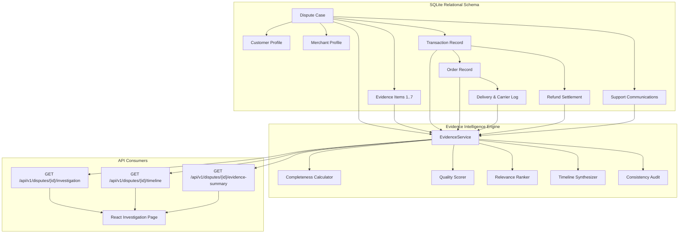
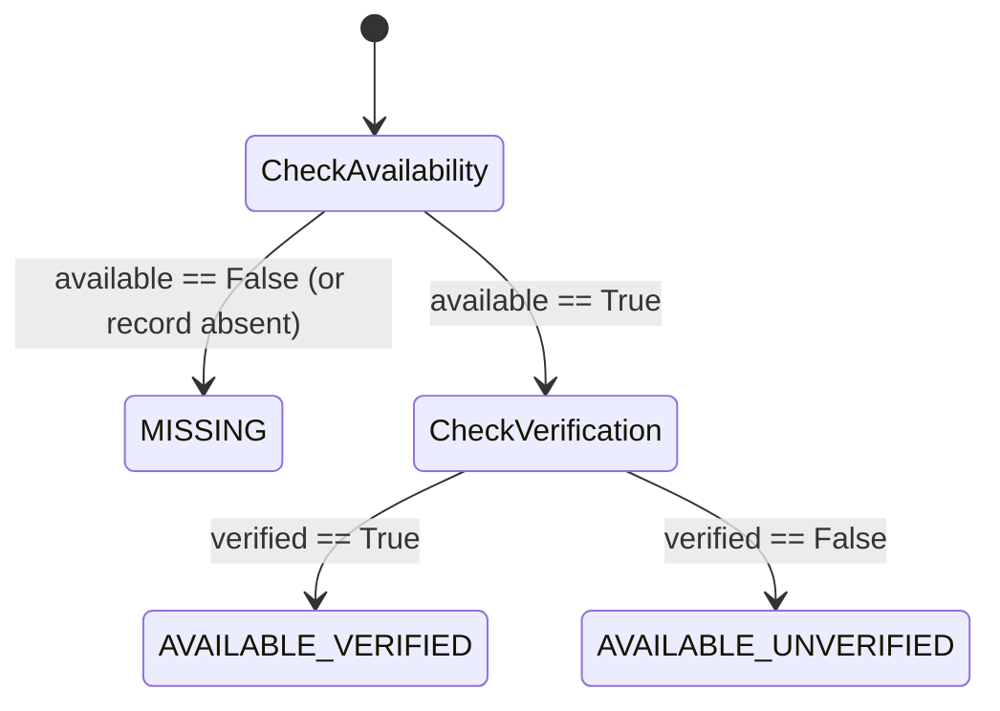

# AI Chargeback Guardian — Evidence Intelligence Engine (Step 4)

The **Evidence Intelligence Engine** is a core analytical subsystem of the AI Chargeback Guardian platform. It investigates incoming payment chargebacks by systematically retrieving, organizing, validating, checking consistency, and scoring all evidence items attached to a disputed transaction.

> [!IMPORTANT]
> **PROTOTYPE & COMPLIANCE NOTICE**  
> This system operates strictly on **synthetic demo data** and deterministic defensive prototype heuristics. The evidence completeness scores, quality metrics, and relevance rankings do **NOT** constitute legal advice, binding card network arbitration rules, or a representation of any real financial institution or payment processor's internal dispute evaluation process. Zero LLM hallucinations are permitted in evidence verification.

---

## 1. Standard Evidence Categories

The Evidence Intelligence Engine supports seven standardized, mutually exclusive operational evidence categories:

| # | Category Identifier | Display Name | Authoritative System Sources | Description & Role in Dispute Defense |
|---|---|---|---|---|
| 1 | `PAYMENT` | Payment Authorization & 3DS Log | Payment Gateway, 3D Secure 2.0 Auth Server | Proof of cardholder authentication, 3DS liability shift, card fingerprint, AVS/CVV matching. |
| 2 | `INVOICE` | Itemized Digital Invoice | ERP Billing System, Accounting Database | Itemized invoice matching customer billing details and transaction amount. |
| 3 | `ORDER` | Order Confirmation & Receipt | E-Commerce Platform, Cart Service | Order placement timestamp, cart SKU details, customer account identifier, checkout log. |
| 4 | `DELIVERY` | Proof of Delivery & Carrier Tracking | Courier API (FedEx, UPS, DHL), GPS Telemetry | Carrier dispatch log, tracking number, GPS delivery coordinates, and signed proof of delivery (POD). |
| 5 | `REFUND` | Refund Audit & Reversal Records | Ledger Settlement Engine, Refund Service | Previous credit reversals, refund audit trails, or disclosure that no refund request was made. |
| 6 | `CUSTOMER_COMMUNICATION` | Customer Support Tickets & Chat | CRM (Zendesk, Intercom), Email Helpdesk | Pre-dispute customer correspondence, support inquiries, delivery confirmations, or dispute dialogue. |
| 7 | `MERCHANT_POLICY` | Terms of Service & Policy Acceptances | Policy Engine, Checkout Session Audit | Accepted Terms of Service (ToS), return/cancellation policy, and merchant dispute disclosure. |

---

## 2. Evidence Retrieval Architecture

The engine is encapsulated in `backend/app/services/evidence_service.py` and accessed via high-performance FastAPI endpoints.



### Retrieval Capabilities
- **Relational Eager Loading**: Performs optimized `joinedload` queries across Customer, Merchant, Transaction, Order, Delivery, Refund, and Communication tables to prevent N+1 query overhead.
- **Robust Error Handling**:
  - `ValueError` / HTTP 404 for invalid or missing dispute IDs.
  - Graceful fallback for cases with zero attached evidence items.
  - Safe handling of missing foreign keys and incomplete timestamps.
  - Sanitized API error envelopes without exposing internal stack traces.

---

## 3. Evidence Status Model

Each evidence category is evaluated into one of three distinct statuses:



1. **`AVAILABLE_VERIFIED`**: Evidence record is present in the database and verified against authoritative system logs (e.g., courier GPS match, 3DS biometric token).
2. **`AVAILABLE_UNVERIFIED`**: Evidence record is present in the merchant store, but has not completed cryptographic or secondary carrier verification.
3. **`MISSING`**: Evidence is missing from the case folder or has not been provided.

> [!CAUTION]
> The engine strictly differentiates between **`MISSING`** evidence and **`AVAILABLE_UNVERIFIED`** evidence. An unverified item still contributes to baseline availability, whereas a missing item directly penalizes availability metrics.

---

## 4. Evidence Completeness Calculation

For every dispute, the engine computes four fundamental counts and two standardized percentages:

### Mathematical Formulas

$$\text{Expected Count} = 7 \quad (\text{Standard mandatory categories})$$

$$\text{Available Count} = \sum_{e \in E} [\text{available}(e) == \text{True}]$$

$$\text{Verified Count} = \sum_{e \in E} [\text{available}(e) == \text{True} \land \text{verified}(e) == \text{True}]$$

$$\text{Missing Count} = \max(0, \text{Expected Count} - \text{Available Count})$$

$$\text{Availability Percentage} = \text{round}\left( \frac{\text{Available Count}}{\text{Expected Count}} \times 100, 1 \right)$$

$$\text{Verification Percentage} = \text{round}\left( \frac{\text{Verified Count}}{\text{Expected Count}} \times 100, 1 \right)$$

### Benchmark Example

| Metric | Calculation | Result |
|---|---|---|
| Expected Categories | Standard 7 categories | **7** |
| Available Items | 6 items with `available == True` | **6** |
| Verified Items | 5 items with `verified == True` | **5** |
| Missing Items | $7 - 6$ | **1** |
| **Availability Percentage** | $(6 / 7) \times 100$ | **85.7%** |
| **Verification Percentage** | $(5 / 7) \times 100$ | **71.4%** |

---

## 5. Configurable Evidence Quality Scoring

The composite **Evidence Quality Score** (0–100) measures the overall defensive strength of the evidence package using a weighted multi-factor heuristic model.

### Configurable Weights
```python
DEFAULT_EVIDENCE_WEIGHTS = {
    "availability": 0.35,  # Ratio of available evidence categories (available / 7)
    "verification": 0.35,  # Ratio of verified evidence categories (verified / 7)
    "recency": 0.15,       # Chronological validity and timestamp availability
    "source": 0.15,        # Authoritative system source validity
}
```

### Formula

$$\text{Quality Score} = \left( \frac{\text{Available}}{7} \cdot w_{\text{avail}} + \frac{\text{Verified}}{7} \cdot w_{\text{verif}} + R_{\text{recency}} \cdot w_{\text{rec}} + S_{\text{source}} \cdot w_{\text{src}} \right) \times 100$$

Where:
- $R_{\text{recency}} = \frac{\text{Available items with valid timestamps}}{\text{Available Count}}$
- $S_{\text{source}} = \frac{\text{Available items with non-empty authoritative sources}}{\text{Available Count}}$

---

## 6. Dispute-Reason Awareness & Relevance Ranking

Evidence strength is dynamically ranked based on the specific chargeback claim reason.

### Relevance Weight Matrix

| Category | GOODS_NOT_RECEIVED | UNAUTHORIZED_TRANSACTION | GOODS_NOT_AS_DESCRIBED | DUPLICATE_TRANSACTION | REFUND_NOT_RECEIVED |
|---|:---:|:---:|:---:|:---:|:---:|
| `DELIVERY` | **1.00 (Critical)** | 0.65 | 0.60 | 0.40 | 0.40 |
| `PAYMENT` | 0.60 | **1.00 (Critical)** | 0.50 | **1.00 (Critical)** | 0.85 |
| `ORDER` | 0.75 | 0.80 | **1.00 (Critical)** | 0.85 | 0.60 |
| `CUSTOMER_COMMUNICATION` | 0.85 | 0.85 | 0.90 | 0.65 | 0.80 |
| `MERCHANT_POLICY` | 0.50 | 0.50 | 0.85 | 0.50 | 0.55 |
| `INVOICE` | 0.70 | 0.70 | 0.75 | 0.90 | 0.65 |
| `REFUND` | 0.40 | 0.40 | 0.40 | 0.80 | **1.00 (Critical)** |

### Strongest Evidence Selection
Each available evidence item is scored:
$$\text{Rank Score} = (\text{Relevance} \times 0.50) + (0.35 \text{ if Verified else } 0.15) + (0.15 \text{ if Authoritative Source else } 0.05)$$
The top 3 scoring items are identified as **`strongest_evidence`** with a contextual rationale.

### Missing Evidence Impact
Missing items are tagged with contextual risk impact:
- **`HIGH`** (Relevance $\ge 0.85$): Critical missing proof for this claim reason.
- **`MEDIUM`** ($0.65 \le \text{Relevance} < 0.85$): Important supporting documentation absent.
- **`LOW`** ($\text{Relevance} < 0.65$): Supplemental evidence category absent.

---

## 7. Consistency Checks & Anomaly Warnings

The engine detects conflicting timestamps, data inconsistencies, and relational mismatches:

| Warning Code | Severity | Description | Trigger Condition |
|---|---|---|---|
| `DELIVERY_CONFIRMED_NO_TIMESTAMP` | **HIGH** | Delivery marked confirmed, but carrier timestamp is missing. | `delivery_confirmed == True` and `delivered_at is None` |
| `REFUND_PROCESSED_INVALID_AMOUNT` | **HIGH** | Refund marked PROCESSED, but refund amount is $\le 0$ or missing. | `refund_status == 'PROCESSED'` and `refund_amount <= 0` |
| `AMOUNT_MISMATCH` | **MEDIUM** | Dispute amount differs from original transaction amount. | $\| \text{dispute\_amount} - \text{txn\_amount} \| > 0.01$ |
| `DELIVERY_BEFORE_ORDER` | **CRITICAL** | Carrier delivery date precedes order placement date. | `delivered_at < order_timestamp` |
| `SHIPMENT_BEFORE_TRANSACTION` | **HIGH** | Consignment shipment date precedes transaction authorization. | `shipped_at < transaction_timestamp` |
| `REFUND_BEFORE_TRANSACTION` | **HIGH** | Refund timestamp precedes original charge date. | `refund_timestamp < transaction_timestamp` |
| `DISPUTE_BEFORE_TRANSACTION` | **CRITICAL** | Dispute filing date precedes transaction authorization. | `dispute_timestamp < transaction_timestamp` |

---

## 8. Investigation Timeline Synthesis

The engine extracts timestamps across all relational entities to build a strictly chronological investigation timeline:

$$\text{Transaction Authorized} \longrightarrow \text{Order Placed} \longrightarrow \text{Carrier Dispatched} \longrightarrow \text{Proof of Delivery} \longrightarrow \text{Customer Inquiries} \longrightarrow \text{Dispute Filed}$$

- **Zero Timestamp Invention**: If an event date is missing from carrier records, it is explicitly flagged as `MISSING_TIMESTAMP` and `is_available: false`.
- **Chronological Sorting**: Events with timestamps are sorted in ascending order; undated events appear at the end with warning indicators.

---

## 9. API Endpoints

### 1. `GET /api/v1/disputes/{dispute_id}/investigation` (and `/api/disputes/{dispute_id}/investigation`)
Returns the complete investigation dossier: dispute metadata, linked profiles, Step 3 ML predictions, evidence completeness, quality score, strongest & missing items, consistency warnings, and chronological timeline.

### 2. `GET /api/v1/disputes/{dispute_id}/timeline` (and `/api/disputes/{dispute_id}/timeline`)
Returns the chronological investigation event timeline.

### 3. `GET /api/v1/disputes/{dispute_id}/evidence-summary` (and `/api/disputes/{dispute_id}/evidence-summary`)
Returns the completeness breakdown, quality score, strongest evidence, and missing evidence.

---

## 10. Example Investigation API Response

```json
{
  "dispute": {
    "id": 1,
    "dispute_reference": "DISP-000001",
    "transaction_id": 5068,
    "customer_id": 482,
    "merchant_id": 29,
    "dispute_reason": "GOODS_NOT_RECEIVED",
    "dispute_amount": 168.25,
    "dispute_status": "RESOLVED",
    "dispute_timestamp": "2026-06-11T07:00:00",
    "outcome": 1,
    "customer": {
      "id": 482,
      "customer_reference": "CUST-000482",
      "account_age_days": 820,
      "previous_successful_transactions": 28,
      "previous_disputes": 0,
      "previous_refunds": 0,
      "customer_risk_history": "LOW"
    },
    "merchant": {
      "id": 29,
      "merchant_reference": "MER-000029",
      "merchant_category": "ELECTRONICS_HARDWARE",
      "historical_dispute_rate": 0.0182,
      "historical_success_rate": 0.954
    },
    "transaction": {
      "id": 5068,
      "transaction_reference": "TXN-005068",
      "amount": 168.25,
      "currency": "USD",
      "transaction_timestamp": "2026-05-26T07:00:00",
      "payment_method_type": "CREDIT_CARD"
    }
  },
  "ml_analysis": {
    "probability": 0.8502,
    "score": 85,
    "classification": "STRONG",
    "recommend_contest": true,
    "threshold": 0.60,
    "model_version": "v1.0",
    "model_name": "xgboost",
    "top_positive_factors": [
      {
        "feature": "delivery_confirmed",
        "display_name": "Delivery Confirmed by Courier",
        "contribution": 0.28,
        "impact": "+28.0%",
        "positive": true
      }
    ],
    "top_negative_factors": [],
    "disclaimer": "PROTOTYPE NOTICE: Synthetic XGBoost risk model..."
  },
  "evidence_analysis": {
    "dispute_id": 1,
    "dispute_reference": "DISP-000001",
    "dispute_reason": "GOODS_NOT_RECEIVED",
    "total_expected": 7,
    "available": 6,
    "verified": 6,
    "missing": 1,
    "availability_percentage": 85.7,
    "verification_percentage": 85.7,
    "quality_score": 90.0,
    "strongest_evidence": [
      {
        "evidence_type": "DELIVERY",
        "category_display_name": "Proof of Delivery & Carrier Tracking",
        "description": "Signed carrier proof of delivery with GPS tracking coordinates",
        "source_reference": "CARRIER_API_FEDEX",
        "status": "AVAILABLE_VERIFIED",
        "relevance_score": 1.0,
        "rank": 1,
        "rationale": "Rank #1: High relevance (100%) for GOODS NOT RECEIVED with verified source 'CARRIER_API_FEDEX'."
      }
    ],
    "missing_evidence": [
      {
        "evidence_type": "REFUND",
        "category_display_name": "Refund Audit & Reversal Records",
        "impact_level": "LOW",
        "impact_description": "Supplemental evidence category. Absence is not fatal to contest submission."
      }
    ],
    "evidence_checklist": [...]
  },
  "timeline": [
    {
      "event_id": "EVT-TXN-5068",
      "event_type": "TRANSACTION",
      "title": "Transaction Authorization",
      "timestamp": "2026-05-26T07:00:00",
      "timestamp_formatted": "2026-05-26 07:00:00",
      "is_available": true,
      "source": "GATEWAY (CREDIT_CARD)",
      "description": "Transaction of $168.25 USD authorized with status SUCCESS.",
      "status_badge": "AUTHORIZED"
    },
    {
      "event_id": "EVT-DISP-1",
      "event_type": "DISPUTE",
      "title": "Chargeback Filed (GOODS_NOT_RECEIVED)",
      "timestamp": "2026-06-11T07:00:00",
      "timestamp_formatted": "2026-06-11 07:00:00",
      "is_available": true,
      "source": "PAYMENT_NETWORK_INCOMING",
      "description": "Dispute claim filed for $168.25 under reason 'GOODS_NOT_RECEIVED'. Status: RESOLVED.",
      "status_badge": "RESOLVED"
    }
  ],
  "warnings": []
}
```
